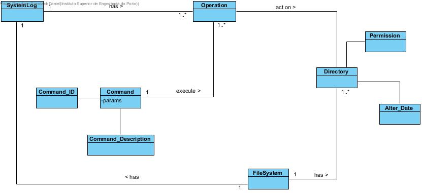

# Backlog

- [UC 1 - Setup basic cmd for User Interface](UC1/UC1.md)
- [UC 2 - Consult all commands and their actions](UC2/UC2.md)
- [UC 3 - Create directory](UC3/UC3.md)
- [UC 4 - Delete directory](UC4/UC4.md)
- [UC 5 - Create file](UC5/UC5.md)
- [UC 6 - Consult file content (Not Implemented)](UC6/UC6.md)
- [UC 7 - Delete file](UC7/UC7.md)
- [UC 8 - Move file/directory](UC8/UC8.md)
- [UC 9 - List files and directories in working directory](UC9/UC9.md)
- [UC 10 - Change directory](UC10/UC10.md)
- [UC 11 - System Log of Events](UC11/UC11.md)

# Domain Model

