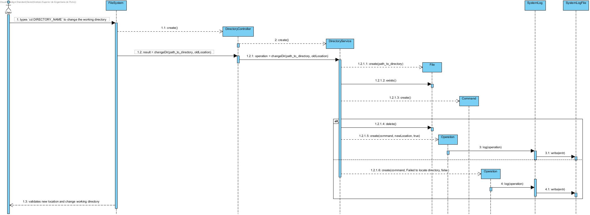

# UC10 - Change Directory

As user I want to change directory

## Analysis

- User types `cd DIRECTORY_NAME` to change the working directory. System validates new location and change working directory.

### Alternatives

- DIRECTORY_NAME is "..".
    - System recognize DOT as going back one directory, and change location to a directory before.

- DIRECTORY_NAME is "/".
    - System recognize "/" as going back to root directory, and change location to root.

### Restrictions

- DIRECTORY_NAME doesn't exists.
    - System alerts the user for that and stays at the same location.

## Design

