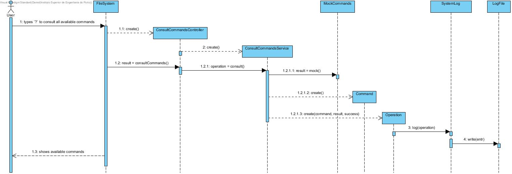

# UC 2 - Consult all commands and their actions

## Analysis

- User types `?` to consult all available commands. System shows available commands.

### Suported commands:

| Command Format | Description |    
| --------| ----------- |
| mkdir DIRECTORY-NAME | Create new directory |
| rmdir DIRECTORY-NAME | Delete directory |
| cd DIRECTORY-NAME | Change working directory |
| nano FILE-NAME | Create new file |
| cat FILE-NAME | Consult file content |
| rm FILE-NAME | Delete file |
| mv [FILE-NAME \| DIRECTORY-NAME ] DESTINATION-DIRECTORY | Move file/directory to other directory |
| ls | List all files and directories in working directory |

## Design

### Sequence Diagram

