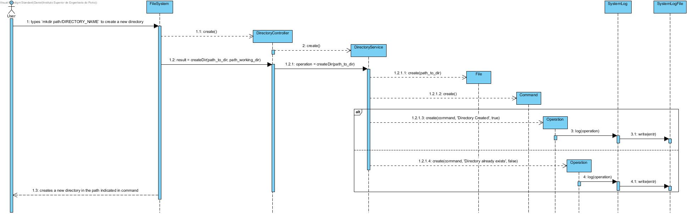

# UC 3 - Create directory

As user I want to create a directory.

## Analysis

- User types `mkdir path/DIRECTORY_NAME` to create a new directory. System creates a new directory in the path indicated in command.

### Restrictions

1. DIRECTORY_NAME already exits in that path.
    - System alerts the user for that and directory isn't created.

## Design

### Sequence Diagram

## Tests

### Service

- testCreateDir()
    - test creating a new directory

- testCreateDir_in_subfolders()
    - test creating a new directory with subfolders

- testCreateDir_when_dir_exists()
    - test no creating a new directory that already exits

### Controller

- testCreateDir()
    - test creating a new directory

    