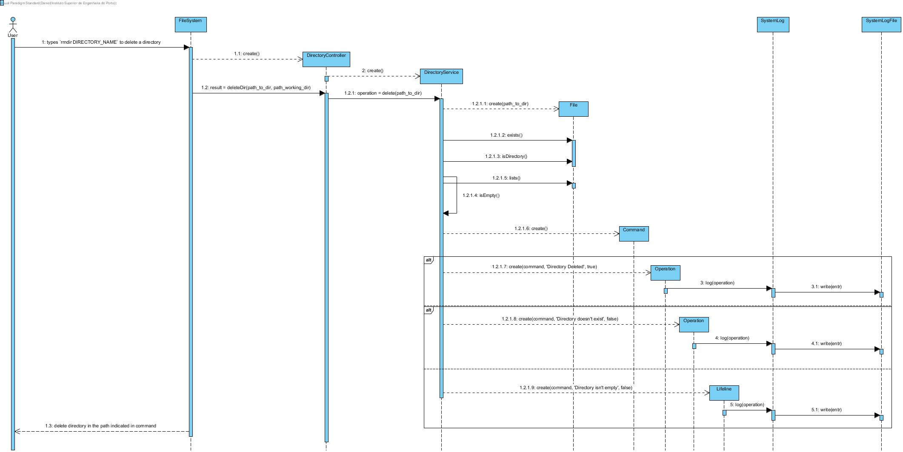

# UC4 - Delete directory

As user I want to delete a directory

## Analysis

- User types `rmdir DIRECTORY_NAME` to delete a directory. System delete directory in the path indicated in command.

### Restrictions

1. DIRECTORY_NAME doesn't exists.
    - System alerts the user for that.
    
2. DIRECTORY_NAME isn't empty.
    - System alerts the user for that and directory isn't deleted.

## Design

### Sequence Diagram

## Tests

### Service

- testDelete()
    - test delete directory.

- testDelete_non_exist_dir()
    - test delete directory that doesn't exists.

- testDelete_non_empty_dir()
    - test delete directory that isn't empty.

### Controller

- testDelete()
    - test delete directory.