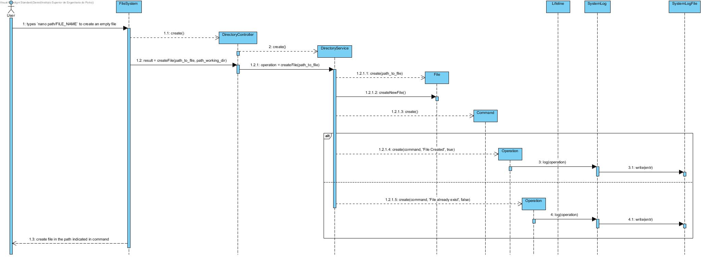

# UC5 - Create a file

As user I want to create a file.

## Analysis

User types `nano path/FILE_NAME` to create an empty file. System create file in the path indicated in command.

### Restrictions

1. FILE_NAME already exits in that path.
    - System alerts the user for that and file isn't created.

## Design

### Sequence Diagram

## Tests

### Service

- testCreateFile()
    - test create new file.

- testCreateFile_when_file_exists()
    - test create new file that already exists.

- testCreateFile_when_path_invalid()
    - test create new file in folder that doesnt exists.

### Controller

- testCreateFile()
    - test create new file.
