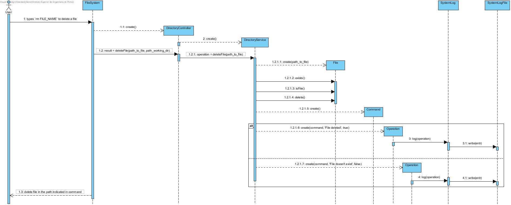

# UC4 - Delete file

As user I want to delete a file

## Analysis

- User types `rm FILE_NAME` to delete a file. System delete file in the path indicated in command.

### Restrictions

1. FILE_NAME doesn't exists.
    - System alerts the user for that.

## Design

### Sequence Diagram

## Tests

### Service

- testDeleteFile()
    - test delete file.

- testDeleteFile_non_exist_file()
    - test delete file that doesn't exists.

### Controller

- testDeleteFile()
    - test delete file.