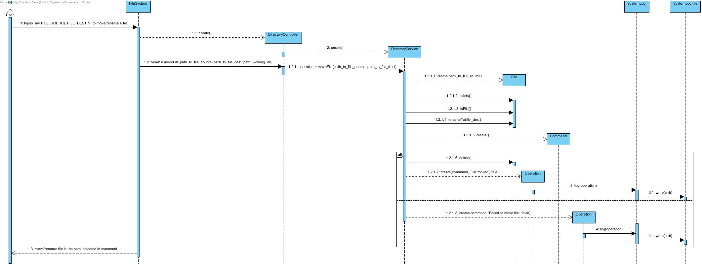

# UC8 - Move / Rename File

As user I want to move/rename file.

## Analysis

- User types `mv FILE_SOURCE FILE_DESTIN` to move/rename a file. System move/rename file in the path indicated in command.

### Restrictions

1. FILE_SOURCE doens't exists in the source path.
    - System alerts the user for that and file isn't moved/renamed.

2. FILE_DESTIN already exists in the destination path.
    - System alerts the user for that and file isn't moved/renamed.

## Design

### Sequence Diagram

