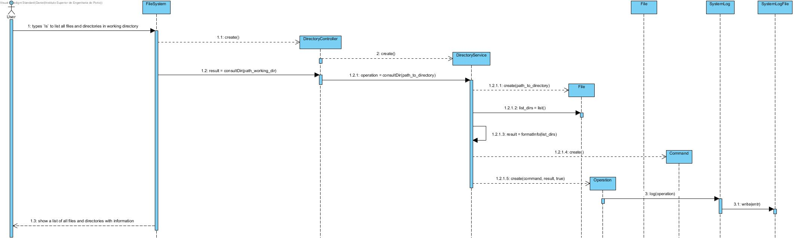

# UC9 - List files and directories in working directory

As user I want to list all files and directories in working directory.

## Analysis

- User types `ls` to list all files and directories in working directory. System show a list of all files and directories with information (date from last update, permissions and type).

## Design

### Sequence Diagram

## Test

### Service

- testConsultDir()
    - test list directories/files in working directory

### Controller

- testConsultDir()
    - test list directories/files in working directory